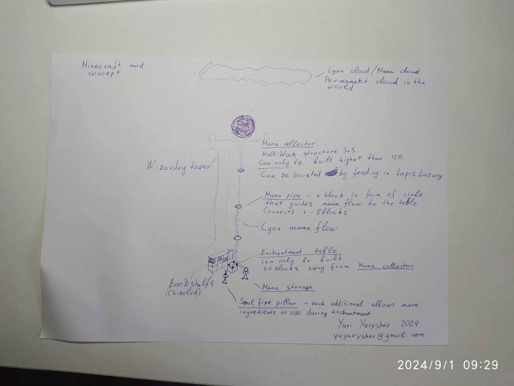

Describes idea of spell system overhaul mod for minecraft.

**Mana cloud** - permanent cyan sparkling cloud that spawn rarely in the world on height of normal clouds. 

**Mana collector** - multiblock sphere - 3 x 3 x 3 build from manastone blocks (likely Botania compartible). Will only work near mana cloud (24 blocks below it max). When built - converts to sphere with some mana flow inside it if under mana cloud. Mana collector can be boosted by feeding in some items like Lapis Lazuri, Diamonds, magical flowers, etc.

**Mana guide** - a circle made of silver or gold to guide mana to the table. Directs mana flow from collector to the table. Can have big spaces - up to 8 blocks - between 2 guides. The flow can be bended - up to 2 blocks per 8 blocks.

**Enchantment table** - classical enchantment table that now requires mana to work. Should be 50 blocks away from mana cloud (and/or mana collector) to work because of mana distorption.  

Enchantment table surroundings:

- **Bookshelfs** - up to 240 blocks, can be located up to 16 blocks away. Needed for higher levels of spells to be used and/or allow better ratio for mana and ingredients.
- **Chiseled bookshelfs** - you should put a book with a spell to use that spell in enchantment table
- **Mana storage sphere** - 1 x 1 x 2 structure - a glowing mana ball on pillar. Can be placed near **Enchantment table** to store mana. Can also be placed above it inside manaflow.
- **Soul fire pillar** - has to be located on equal range from the table up to 10 blocks, each additional is required to use more ingredients during enchantment ritual. The highest spells require 8 pillars.

The ritual:

- Each enchantment starts by placing all ingredients into the table. You can add any number of enchantments to single item at once if you have enough resources.
- The ritual starts with slow mana accumulation and some other fancy wizardry circles around the table. During this phase ingredients in form of items move syncroniously from the table to soul fire pillars.
- Then process accelerates, mana rapidly flows to the table.
- Ingredients are burnt in soul spark and converted to colored glow
- Mana and ingredient essences are all collapse and blow up on the table.
- The last 2 stages happen rapidly for each enchantment level you are applying to the item.

**Create mod compartibility**

- It would be nice if the process can be started by inserter that inserts "ritual schema" into enchantment table togather with all required ingredients. Which are likely to be taken from some storage below this room. The table should accept only ingredients needed by ritual schema
- **Ritual schema** - an nbt item that is made on the table with a paper and small amount of mana. This item allows one to preset all enchantments needed. Ritual schema isn't consument during ritual. It also has a checkbox to decide if it should be removed from table after ritual or not. If it is - it will be thrown below the table after ritual togather with processed item.

# Enchantment recipes overhaul

The idea is mostly based on [GitHub - CmdrJane/enchanting-system-overhaul](https://github.com/CmdrJane/enchanting-system-overhaul) - a very good mod on my taste, but lacking many features I'd love to see.

Research process:

- To enchant a spell you have to find a spellbook and place it into chiseled bookshelf
- You can also boost spell level by finding and placing additional books
- You can also research spells, to do so you need at least one book and lots of enchanted items that have same enchantment. Each item will give you small portion of special exp points. Say you have found an axe with Effective I - if you research it, the axe will be disenchanted, and you get 5% of "Effective" exp gauge. This exp gauge is associated with the table and is to be stored in chiseled bookshelf in form of "Effective spell research journal".
  - Configurable - you want be able to research items you enchanted, only ones you found in the world.
- You can research mob loot - this gives small boost of knowledge to all spells
- You can also research ingredients - this gives small boost of knowledge to all spells that have them. And also less ingredients is needed for future rituals. 
- There can be different journals - for spells or for groups of spells.
